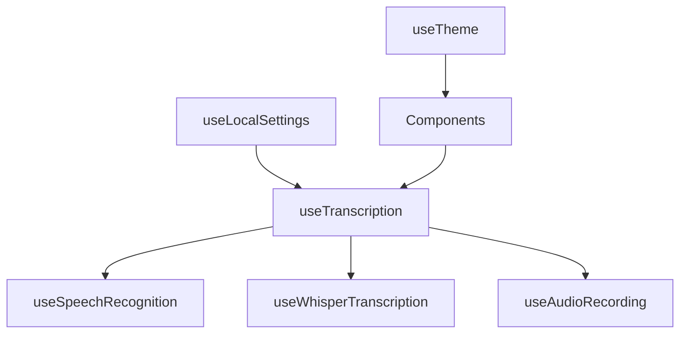

# Careless Live


A modern, privacy-focused speech-to-text transcription application that runs entirely in your browser or with local Whisper servers. Convert speech to text with customizable timing controls, multiple transcription engines, and export capabilities—all while keeping your data private and secure.

## ✨ Features

- **🎤 Multiple Transcription Engines**: Browser Speech API, Local Whisper Server, or Browser Whisper (Beta)
- **🔒 Privacy-First**: All processing happens locally—no data sent to external services
- **⚙️ Customizable Timing**: Adjust pause detection for sentences and paragraphs
- **🌙 Dark/Light Mode**: Beautiful responsive design with theme switching
- **📁 Export Options**: Save transcriptions as text files
- **🎛️ Real-time Controls**: Start, stop, and clear transcriptions instantly
- **📱 Cross-Platform**: Works on Windows, macOS, and Linux

## 🚀 Quick Start

### Prerequisites
- **Node.js** (v18 or higher) - [Download here](https://nodejs.org/)
- **Git** - [Download here](https://git-scm.com/)
- **Modern Web Browser** with microphone access

### Installation
```bash
# Clone the repository
git clone <your-repository-url>
cd speech-transcription-app

# Install dependencies
npm install

# Start the development server
npm run dev
```

Open your browser to `http://localhost:5173` and grant microphone access when prompted.

## 📖 User Guide

### Basic Operation
1. **Select Transcription Engine** in Settings (Browser Speech API is default)
2. **Click the microphone button** to start transcription
3. **Speak clearly** into your microphone
4. **Click stop** when finished or let auto-stop handle long pauses
5. **Export your text** using the export button

### Timing Controls
- **Sentence Break**: Pause duration before starting a new sentence (default: 1 second)
- **Paragraph Break**: Pause duration before starting a new paragraph (default: 3 seconds)
- **Sleep Mode**: Auto-stop transcription after extended silence (default: 10 seconds)

## 🔧 Installation Guide

For detailed Windows installation instructions, see [INSTALL.md](docs/INSTALL.md).

## 🎯 Transcription Engine Setup

### Browser Speech API (Default)
- **Pros**: Built-in, no setup required, real-time results
- **Cons**: Requires internet, limited language models
- **Setup**: None required—works out of the box

### Local Whisper Server (Advanced)
- **Pros**: Offline, high accuracy, multiple models
- **Cons**: Requires Python setup, more resource intensive
- **Setup**: Install `whisper-server` via pip and configure server URL in settings

```bash
# Quick Whisper Server Setup
pip install whisper-server
whisper-server --model base --port 8000
```

### Browser Whisper (Beta)
- **Pros**: Offline, no server required
- **Cons**: Experimental, requires modern browser with WebGPU
- **Setup**: Install `@huggingface/transformers` package

---

## 👨‍💻 Developer Section

### Technology Stack
- **Frontend Framework**: React 18 with TypeScript
- **Build Tool**: Vite for fast development and building
- **Styling**: Tailwind CSS with custom design system
- **UI Components**: Radix UI primitives with shadcn/ui
- **Speech Recognition**: Web Speech API, OpenAI Whisper
- **State Management**: React hooks with custom abstractions
- **Icons**: Lucide React and FontAwesome
- **Theme System**: next-themes for dark/light mode

### Project Structure
```
src/
├── components/           # React components
│   ├── ui/              # Reusable UI components (shadcn/ui)
│   ├── Header.tsx       # App header with theme toggle
│   ├── ControlPanel.tsx # Transcription controls
│   ├── TranscriptionArea.tsx  # Text display and editing
│   └── SettingsModal.tsx     # Configuration dialog
├── hooks/               # Custom React hooks
│   ├── useTranscription.ts   # Main transcription orchestrator
│   ├── useSpeechRecognition.ts # Browser Speech API wrapper
│   ├── useWhisperTranscription.ts # Whisper integration
│   ├── useAudioRecording.ts    # Audio capture utilities
│   ├── useLocalSettings.ts    # Settings persistence
│   └── useTheme.ts            # Theme management
├── pages/               # Page components
│   ├── Index.tsx        # Main application page
│   └── NotFound.tsx     # 404 error page
├── utils/               # Utility functions
│   └── fileExport.ts    # Text file export utilities
├── lib/                 # Library configurations
│   └── utils.ts         # Utility functions and helpers
└── index.css           # Global styles and design tokens
```

### Development Commands
```bash
# Development server with hot reload
npm run dev

# Build for production
npm run build

# Build development version
npm run build:dev

# Preview production build
npm run preview

# Run ESLint
npm run lint
```

### Architecture Overview

The application uses a **hook-based architecture** with clear separation of concerns:



- **`useTranscription`**: Main orchestrator that coordinates different engines
- **`useSpeechRecognition`**: Wraps Web Speech API with custom timing
- **`useWhisperTranscription`**: Handles both server and browser Whisper integration
- **`useAudioRecording`**: Manages microphone input and audio processing
- **`useLocalSettings`**: Persists user preferences in localStorage

### External Whisper Engine Integration

#### Server-Based Whisper

The application supports OpenAI-compatible Whisper servers:

```typescript
// Server endpoint format
POST /v1/audio/transcriptions
Content-Type: multipart/form-data

// Request body
{
  file: Blob,     // Audio file (WebM/Opus format)  
  model: string   // Model name (e.g., "whisper-1", "base", "large")
}

// Response format
{
  text: string,
  confidence?: number
}
```

**Compatible Servers:**
- **whisper-server** (Python): `pip install whisper-server`
- **OpenAI API**: Direct integration with OpenAI's Whisper API
- **Self-hosted solutions**: Any server implementing the OpenAI Whisper API spec

#### Browser-Based Whisper (Beta)

Uses `@huggingface/transformers` for client-side processing:

```bash
# Install browser Whisper support
npm install @huggingface/transformers
```

The implementation automatically downloads and caches Whisper models in the browser for offline use.

### Custom Hooks Documentation

#### `useTranscription(settings: AppSettings)`

Main transcription orchestrator hook.

**Parameters:**
- `settings.transcriptionEngine`: `'speech' | 'whisper'`
- `settings.whisperSettings`: Server configuration
- `settings.speechSettings`: Timing and language options

**Returns:**
```typescript
{
  transcript: string              // Final transcription text
  interimTranscript: string      // Live/interim results
  isListening: boolean           // Recording state
  error: string | null           // Error messages
  confidence: number             // Transcription confidence (0-1)
  startListening: () => void     // Start transcription
  stopListening: () => void      // Stop transcription  
  clearTranscript: () => void    // Clear results
  isSupported: boolean           // Engine availability
}
```

#### `useSpeechRecognition(settings?: SpeechSettings)`

Web Speech API integration with custom timing controls.

**Parameters:**
```typescript
interface SpeechSettings {
  sentencePauseDuration?: number    // Sentence break timing (ms)
  paragraphPauseDuration?: number   // Paragraph break timing (ms)
  sleepModeAfter?: number          // Auto-stop timeout (ms)
  language?: string                // BCP 47 language code
}
```

#### `useWhisperTranscription(settings: WhisperSettings)`

Whisper engine integration supporting both server and browser modes.

**Parameters:**
```typescript
interface WhisperSettings {
  serverUrl?: string               // Whisper server endpoint
  model?: string                   // Model name
  engine: 'server' | 'browser'     // Processing location
}
```

#### `useAudioRecording(settings?: AudioRecordingSettings)`

Audio capture and processing utilities.

**Parameters:**
```typescript
interface AudioRecordingSettings {
  deviceId?: string                // Microphone device ID
  sampleRate?: number              // Audio sample rate (Hz)
  channels?: number                // Audio channel count
}
```

### Code Style Guidelines

- **TypeScript**: Strict mode enabled, prefer interfaces over types
- **React**: Functional components with hooks, avoid class components
- **Styling**: Use Tailwind CSS with semantic design tokens from `index.css`
- **State Management**: Prefer `useCallback` and `useMemo` for performance
- **Error Handling**: Always provide user-friendly error messages
- **Accessibility**: Follow WCAG guidelines, proper ARIA labels

### Design System

The application uses a custom design system built on Tailwind CSS:

```css
/* Design tokens in index.css */
:root {
  --primary: 222.2 84% 4.9%;
  --primary-foreground: 210 40% 98%;
  --secondary: 210 40% 96%;
  /* ... more semantic color tokens */
}
```

**Key Principles:**
- Use semantic color tokens instead of hardcoded colors
- Support both light and dark themes
- Maintain consistent spacing and typography scales
- Ensure proper contrast ratios for accessibility

### Performance Considerations

- **Audio Processing**: Uses Web Audio API for efficient real-time processing
- **Memory Management**: Automatic cleanup of media streams and recognition instances
- **Bundle Size**: Tree-shaking enabled, code splitting for different engines
- **Caching**: Service worker ready for offline functionality

### Contributing

1. **Fork the repository** and create a feature branch
2. **Follow the existing code style** and add TypeScript types
3. **Add tests** for new functionality (when test framework is added)
4. **Update documentation** for new features or API changes
5. **Submit a pull request** with a clear description of changes

### Troubleshooting

#### Common Issues

**Microphone not working:**
- Check browser permissions in site settings
- Ensure HTTPS connection (required for microphone access)
- Try different browsers (Chrome/Edge recommended)

**Poor transcription accuracy:**
- Speak clearly and at moderate pace
- Reduce background noise
- Check microphone quality and positioning
- Try different transcription engines

**Whisper server connection issues:**
- Verify server URL format (include `http://` or `https://`)
- Check server status and model loading
- Ensure CORS headers are configured on server

**Build or dependency issues:**
- Clear node_modules: `rm -rf node_modules package-lock.json && npm install`
- Update Node.js to latest LTS version
- Check for conflicting global packages

#### Getting Help

- **Documentation**: Check [INSTALL.md](docs/INSTALL.md) for setup issues
- **Browser Console**: Press F12 to check for JavaScript errors
- **Issues**: Report bugs with browser version and error messages
- **Discussions**: Share usage questions and feature requests

---

## 🤝 Acknowledgments

- **OpenAI Whisper** for state-of-the-art speech recognition
- **Hugging Face** for browser-based transformer models  
- **Web Speech API** for native browser speech recognition
- **shadcn/ui** for beautiful, accessible UI components
- **Radix UI** for unstyled, accessible component primitives

## 📄 License

This project is open source and available under the [MIT License](LICENSE).
